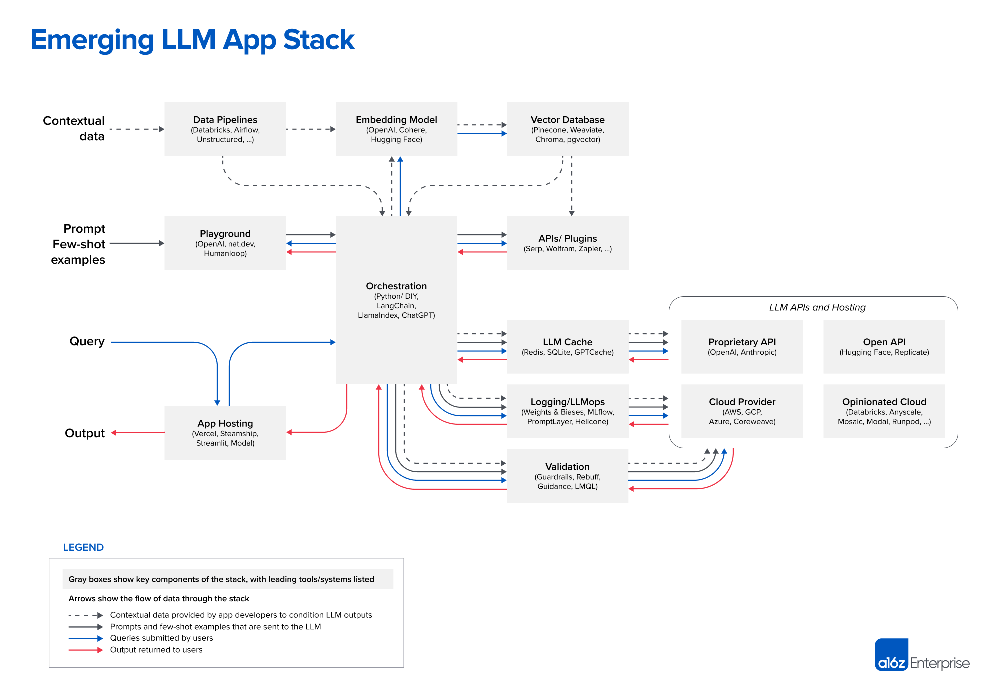

# Advanced RAG With Semantic Caching, Semantic Routing, and Observability (Langchain, Ollama, Milvus, Redis, Langfuse, and Uptrain)



### Above is an example of an emerging LLM App stack that is highly adopted by most GenAI Enterprises.

## Three Important RAG Techniques for a GenAI Platform

1. **Semantic Caching:** 
   - Semantic caching in Retrieval-Augmented Generation (RAG) systems enhances efficiency and relevance by storing semantically relevant information, reducing retrieval time and computational resources.

2. **LLM Routing:**
   - LLM routing using LiteLLM involves directing user queries to the most appropriate language model based on factors like query complexity, domain specificity, or required response quality. This optimizes the use of computational resources and improves response accuracy.

3. **Guardrails:**
   - Guardrails are mechanisms or guidelines implemented to ensure that a system, especially an AI or machine learning model, operates within safe, ethical, and intended boundaries, preventing unintended outcomes or misuse.

## Evaluating RAG Pipeline

1. **UpTrain:**
   - UpTrain is an open-source platform for evaluating and improving LLM applications.

2. **Langfuse:**
   - Langfuse is an open-source platform for monitoring, evaluating, and improving LLM applications.

## Installation

1. **Clone the Repository:**
   ```bash
   git clone https://github.com/aishwaryaprabhat/Advanced-RAG.git
   cd Advanced-RAG

2. **Install the requirements:**
   ```bash
   pip install -r requirements.txt

3. **Run the Notebook:**

    Launch the Jupyter Notebook in your environment and open the project notebooks to start exploring and experimenting with the RAG techniques.

## Contributing
We welcome contributions to this project! Please read our contributing guidelines to get started.
